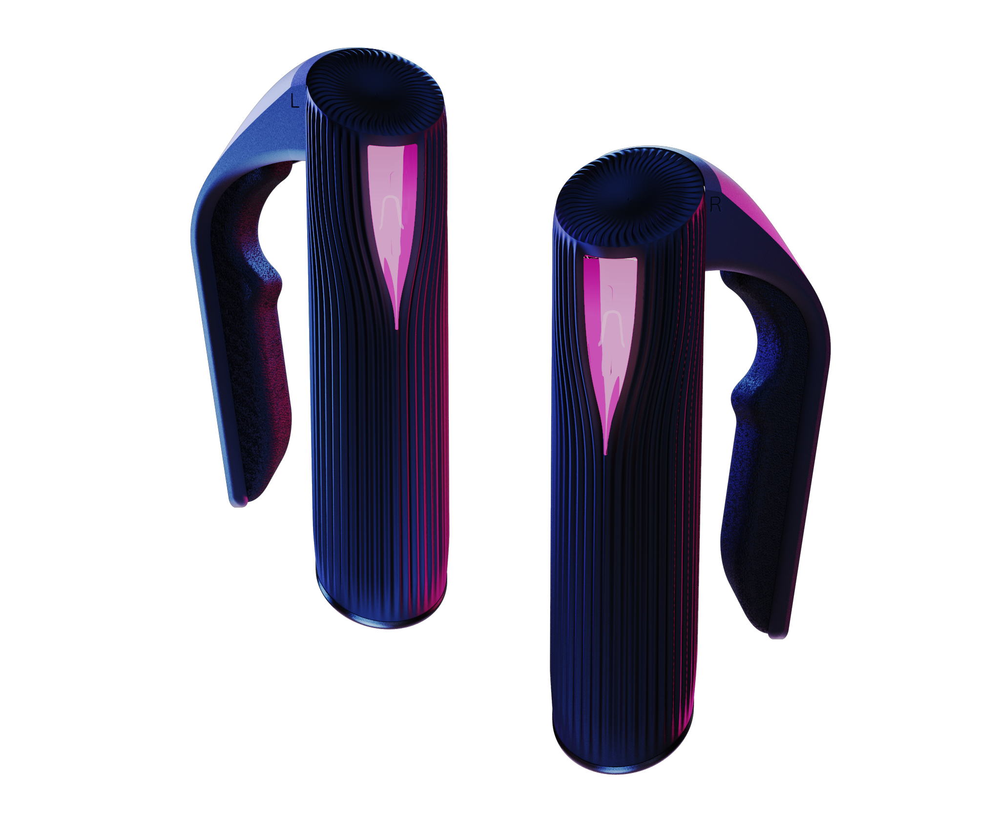

<!-- README file in MD for the eteeCpntroller 3D Models repository-->

<!-- PROJECT LOGO -->
 

<!-- SHIELDS FOR SOCIALS -->

    
    
    

<!-- ABOUT THE REPOSITORY -->
## About the Repository

This repository contains 3D model files for eteeController components. 
You can use these to personalise your devices, measure dimensions for
custom projects, etc. 

To learn more about the eteeControllers, visit our website: [eteexr.com](https://eteexr.com/).

Let your creativity flow!

    

<!-- CONTACT -->
## Contact

For any queries or reports about the 3D models, please use the [**Issues tab**][url-issues-tab] in this repository.
When possible, use an identifier to help us describe your query, report or request.

- `query`: Questions about the 3D models.
- `issue`: Reporting an issue encountered with the 3D models.
- `request`: Any request for components or file types.

**Format**: `<identifier>: <subject>`. For example: `request: Handle 3D Models`.

For further support or queries, you can contact us:
- Support e-mail: [customer@eteexr.com](customer@eteexr.com)
- Support Form: [https://eteexr.com/pages/support-form](https://eteexr.com/pages/support-form)

<!-- MARKDOWN LINKS & IMAGES -->
<!-- https://www.markdownguide.org/basic-syntax/#reference-style-links -->
[url-issues-tab]: https://github.com/eteeXR/eteeController-3D-models/issues
